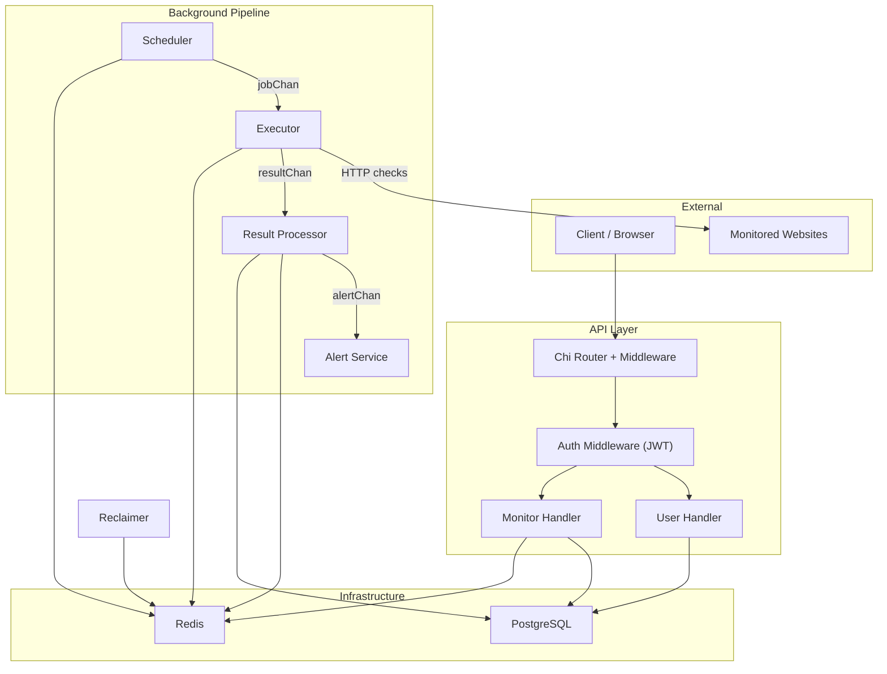
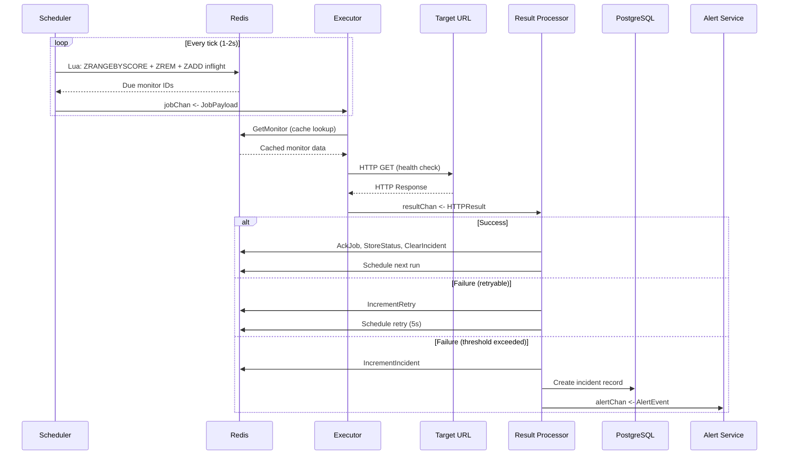
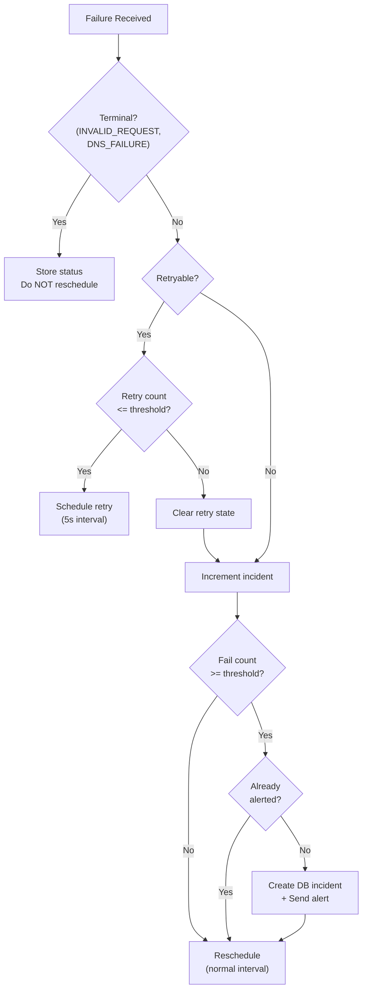
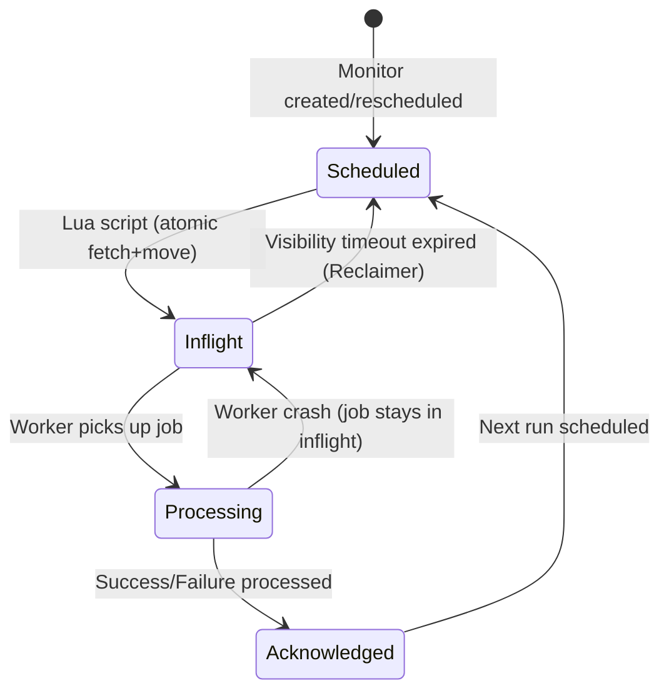
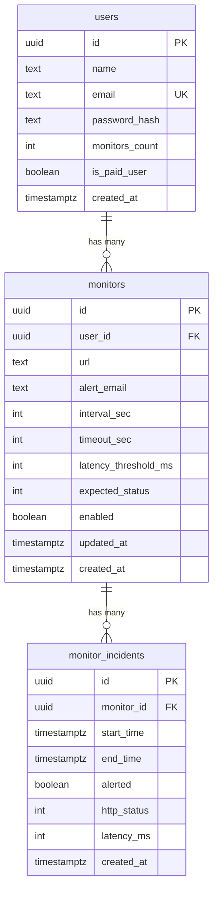

# Monit — Distributed Uptime Monitoring System

A **high-performance, fault-tolerant** uptime monitoring service built in Go, designed to handle **1M+ monitoring jobs** with distributed Redis-based scheduling, atomic Lua scripts, and a channel-based worker pipeline.

## Table of Contents

- [System Overview](#system-overview)
- [Architecture](#architecture)
- [Core Pipeline](#core-pipeline)
- [Distributed Scheduling](#distributed-scheduling)
- [Reliability & Fault Tolerance](#reliability--fault-tolerance)
- [Performance Optimizations](#performance-optimizations)
- [Scalability Analysis](#scalability-analysis)
- [Engineering Challenges](#engineering-challenges)
- [Why Go](#why-go)
- [Code Quality & Design](#code-quality--design)
- [Project Structure](#project-structure)
- [Tech Stack](#tech-stack)
- [Configuration](#configuration)
- [Database Schema](#database-schema)
- [Getting Started](#getting-started)
- [API Reference](#api-reference)

---

## System Overview

Monit is a production-grade website monitoring service that continuously checks the health of registered URLs. When a monitored endpoint fails, the system detects it, retries intelligently, creates incidents, and triggers alerts — all while maintaining high throughput and zero job loss guarantees.

### What It Does

1. **Schedules** millions of HTTP health checks using Redis sorted sets
2. **Executes** checks concurrently with configurable worker pools and semaphore-controlled HTTP concurrency
3. **Processes results** through dedicated success/failure pipelines with retry logic
4. **Detects incidents** using Redis-backed state machines with atomic operations
5. **Alerts** users when sustained failures exceed configurable thresholds
6. **Recovers** automatically from crashes via inflight job reclamation

### Key Properties

| Property | How It's Achieved |
|---|---|
| **Highly Scalable** | Channel-based pipeline, configurable worker pools, Redis sorted sets for O(log N) scheduling |
| **Highly Reliable** | Lua-script atomicity, inflight visibility timeouts, automatic job reclamation |
| **Fault Tolerant** | Graceful shutdown, ordered channel closure, retry with backoff, backpressure protection |
| **High Performance** | Redis caching eliminates DB reads on hot path, HTTP semaphore caps concurrent connections |
| **Maintainable** | Clean module boundaries, DI container, custom error handling, idiomatic Go |

---

## Architecture

### High-Level Architecture



### Component Interaction



---

## Core Pipeline

The system uses a **channel-based pipeline** that connects five independent stages. Each stage runs as a pool of goroutines, communicating exclusively via Go channels.

```
┌───────────┐    jobChan     ┌──────────┐   resultChan   ┌─────────────────┐   alertChan   ┌──────────────┐
│ Scheduler │ ──────────────>│ Executor │ ──────────────>│ Result Processor│ ─────────────>│ Alert Service│
└───────────┘                └──────────┘                └─────────────────┘              └──────────────┘
     │                            │                           │        │
     │                            │                           │        │
   Redis                     Redis+HTTP                    Redis     PostgreSQL
 (sorted set)               (cache+check)             (state machine)  (incidents)
```

### Stage 1: Scheduler

**Responsibility**: Pull due monitoring jobs from Redis and dispatch them to the executor.

- Runs on a configurable tick interval (typically 1-2 seconds)
- Uses **Lua scripts** to atomically fetch due jobs and move them to an inflight set
- Implements **backpressure protection**: if `jobChan` is full, jobs are rescheduled with jitter instead of being dropped
- Adds random jitter to prevent thundering herd on reschedule

### Stage 2: Executor

**Responsibility**: Load monitor config, execute HTTP health checks, and emit results.

- **Worker Pool**: `N` goroutines (configurable, e.g., 100) read from `jobChan`
- **HTTP Semaphore**: A separate `chan struct{}` of size `M` (e.g., 5000) limits concurrent HTTP connections, preventing file descriptor exhaustion
- **Two-tier concurrency**: Workers acquire from `jobChan`, then spawn a goroutine per HTTP check that must acquire the semaphore
- **Error Classification**: Distinguishes DNS failures (terminal), timeouts (retryable), and network errors (retryable) for downstream routing
- **Monitor Caching**: Loads monitor config from Redis cache first, falling back to PostgreSQL — eliminating DB reads on the hot path

```go
// Executor concurrency model
for job := range jobChan {           // N workers compete for jobs
    monitor := loadFromCacheOrDB()   // Redis first, DB fallback
    httpSem <- struct{}{}            // Acquire HTTP slot (blocks if M in-flight)
    go func() {
        defer func() { <-httpSem }() // Release HTTP slot
        result := executeHTTPCheck(monitor)
        resultChan <- result
    }()
}
```

### Stage 3: Result Processor

**Responsibility**: Route results, manage retry/incident state machines, trigger alerts.

- **Router goroutine** reads from `resultChan` and fans out to `successChan` or `failureChan`
- **Success workers** clear retry/incident state and schedule the next check
- **Failure workers** implement a multi-stage decision tree:



### Stage 4: Alert Service

**Responsibility**: Process alert events from the alert channel using a worker pool.

### Stage 5: Reclaimer (Independent)

**Responsibility**: Recover jobs stuck in the inflight set (crashed/slow workers).

- Runs on its own ticker (every 5-10 seconds)
- Uses a Lua script to atomically move expired inflight jobs back to the schedule set
- Ensures **zero job loss** even if executor workers crash

---

## Distributed Scheduling

### The Problem

In a distributed system with multiple instances, how do you ensure:
1. Each monitoring job runs **exactly once** per interval?
2. No jobs are **lost** if a worker crashes mid-execution?
3. Scheduling remains **atomic** even under high concurrency?

### The Solution: Dual Sorted Sets + Lua Scripts

Redis sorted sets (`ZSET`) are used as a priority queue where:
- **Score** = Unix timestamp (milliseconds) of when the job should run
- **Member** = Monitor UUID

Two sorted sets work together:

| Set | Purpose |
|---|---|
| `monitor:schedule` | Jobs waiting to be executed. Score = next run time |
| `monitor:inflight` | Jobs currently being processed. Score = visibility timeout deadline |

### Three Lua Scripts

All scheduling operations are implemented as **Lua scripts** executed atomically on Redis, eliminating race conditions across multiple instances.

#### 1. `fetchAndMoveToInflight` — Atomic Job Dispatch

```lua
-- Atomically: fetch due jobs AND move them to inflight in one operation
local items = redis.call("ZRANGEBYSCORE", scheduleKey, "-inf", now, "LIMIT", 0, limit)
for i, member in ipairs(items) do
    redis.call("ZREM", scheduleKey, member)
    redis.call("ZADD", inflightKey, now + visibilityTimeout, member)
end
return items
```

**Why this matters**: Without atomicity, two scheduler instances could both fetch the same job. The Lua script guarantees that fetch + remove + add-to-inflight happens as a single Redis operation — no locks, no races.

#### 2. `reclaimMonitors` — Crash Recovery

```lua
-- Move expired inflight jobs (visibility timeout exceeded) back to schedule
local items = redis.call("ZRANGEBYSCORE", inflightKey, "-inf", now, "LIMIT", 0, limit)
for i, member in ipairs(items) do
    redis.call("ZREM", inflightKey, member)
    redis.call("ZADD", scheduleKey, now, member)
end
return #items
```

**Why this matters**: If a worker takes a job but crashes before acknowledging it, the visibility timeout expires and the Reclaimer automatically moves it back for re-execution.

#### 3. `fetchDueMonitors` — Simple Fetch (Non-Reliable Mode)

```lua
-- Fetch and remove due jobs (for benchmarking against reliable mode)
local items = redis.call("ZRANGEBYSCORE", key, "-inf", now, "LIMIT", 0, limit)
for i, member in ipairs(items) do
    redis.call("ZREM", key, member)
end
return items
```

### Job Lifecycle



---

## Reliability & Fault Tolerance

### 1. Zero Job Loss Guarantee

Every job that enters the system will eventually be processed:

- **Inflight visibility timeout**: Jobs in the inflight set have a deadline. If not acknowledged in time, the Reclaimer moves them back to the schedule set
- **Backpressure protection**: If `jobChan` is full, the scheduler reschedules the job with a 2-second backoff + jitter instead of dropping it
- **Graceful shutdown**: Channels are closed in strict dependency order, ensuring every in-flight message is drained

### 2. Graceful Shutdown

The shutdown sequence is carefully ordered to prevent data loss:

```
1. close(jobChan)           ← Scheduler stops producing
2. executor.Stop()          ← Wait for all workers + HTTP goroutines to finish
3. close(resultChan)        ← Executor output is drained
4. resultProcessor.Wait()   ← Wait for all success/failure workers
5. close(alertChan)         ← Result processor output is drained
6. alertService.Wait()      ← Wait for all alert workers
7. redis.Close()            ← Infrastructure cleanup
```

Each `close()` triggers the downstream `for range` loop to exit, ensuring every message in every channel is processed before shutdown completes.

### 3. Resilient Error Handling

- **Custom `apperror` package** with `Kind`, `Op`, and stack traces for structured error classification
- **`WrapRepoError`** utility function consistently applied across all repositories, mapping `pgx.ErrNoRows` → `apperror.NotFound` and other DB errors → `apperror.Internal`
- **Retry helper** with exponential backoff (50ms, 100ms, 150ms) for all Redis operations
- **Worker continuity**: Executor workers use `continue` (not `return`) on errors, ensuring a single bad job doesn't kill the worker goroutine

### 4. Incident State Machine

Redis hashes track incident state per monitor with the following fields:

```
monitor:incident:<uuid>
├── failure_count: int        ← Incremented on each failure
├── first_failure_at: unix_ts ← Set on first failure
├── last_failure_at: unix_ts  ← Updated on each failure
├── alerted: bool             ← Set atomically via HSETNX (prevents duplicate alerts)
└── db_incident: bool         ← Tracks if DB incident record was created
```

The `MarkIncidentAlertedIfNotSet` method uses Redis `HSETNX` for **atomic alert deduplication** — even with multiple workers processing failures for the same monitor, only one will trigger the alert.

---

## Performance Optimizations

### 1. Redis Cache on Hot Path (Eliminating DB Reads)

The executor's hot path (called for every health check) loads monitor configuration. Without caching, this would be a PostgreSQL query per check — at 1M checks/hour, that's ~278 QPS just for monitor lookups.

```
Hot path WITHOUT cache:    Executor → PostgreSQL → Execute HTTP check
Hot path WITH cache:       Executor → Redis (sub-ms) → Execute HTTP check
                                       ↓ (cache miss only)
                                    PostgreSQL
```

Monitor data is cached in Redis for 24 hours, serialized as `[]byte`. The `cacheMonitor()`/`getCachedMonitor()` helpers in the service layer handle marshal/unmarshal, keeping the Redis layer generic.

### 2. HTTP Semaphore (Bounded Concurrency)

Instead of spawning unbounded goroutines for HTTP checks, a semaphore channel limits concurrent connections:

```go
httpSem := make(chan struct{}, 5000) // Max 5000 concurrent HTTP requests

// Before HTTP check:
httpSem <- struct{}{}  // Block if 5000 already in-flight

// After HTTP check:
<-httpSem  // Release slot
```

This prevents file descriptor exhaustion and allows fine-tuning of network pressure.

### 3. O(log N) Scheduling with Sorted Sets

Redis sorted sets provide `ZRANGEBYSCORE` in O(log N + M) where M is the result count. For 1M monitors, finding all due jobs is logarithmic — compared to scanning a database table which would be O(N).

### 4. Batch Operations

- `ScheduleBatch()` uses `ZADD` with multiple members in a single Redis call
- Lua scripts process multiple jobs atomically in a single Redis roundtrip
- `FetchAndMoveToInflight` fetches up to `batchSize` (configurable: 100-1000) jobs per tick

### 5. Connection Pool Tuning

Both Redis and PostgreSQL connection pools are configurable:

```yaml
redis:
  pool_size: 10          # Concurrent Redis connections
  min_idle_conns: 5      # Pre-warmed connections
  conn_max_lifetime: 2m  # Prevent stale connections

db:
  max_open_conns: 50     # Max PostgreSQL connections
  min_idle_conns: 5
  conn_max_lifetime: 1h
```

---

## Scalability Analysis

### How This Handles 1 Million Monitors

| Component | Scaling Strategy | Capacity |
|---|---|---|
| **Scheduler** | Lua script fetches up to 1000 jobs/tick. At 1s tick = 1000 jobs/sec = 3.6M/hour | Exceeds 1M easily |
| **Executor Workers** | 100 workers × 50 jobs/sec/worker = 5000 jobs/sec | CPU-bound scaling |
| **HTTP Semaphore** | 5000 concurrent HTTP connections | Network-bound scaling |
| **Redis** | Single Redis handles 100K+ ops/sec; sorted sets are O(log N) | Handles millions |
| **Result Processor** | Separate success/failure worker pools with configurable counts | Independent scaling |
| **Channels** | Buffered channels (configurable 100-5000) act as shock absorbers | Handles burst traffic |

### Horizontal Scaling

Multiple instances of this service can run simultaneously because:
1. **Lua scripts are atomic** — no two instances can grab the same job
2. **Inflight tracking** — each instance only processes what it fetched
3. **Reclaimer** — if any instance fails, another will recover its jobs

---

## Engineering Challenges

### Challenge 1: Making Scheduling Atomic Across Multiple Instances

**Problem**: When multiple instances of the scheduler run concurrently, how do you prevent two instances from fetching the same job?

**Failed approaches considered**:
- Distributed locks (Redis SETNX) → too much overhead per job
- Database-based scheduling → too slow for high throughput

**Solution**: Redis Lua scripts execute atomically on the Redis server. The `fetchAndMoveToInflight` script combines `ZRANGEBYSCORE` + `ZREM` + `ZADD` into a single atomic operation. Redis guarantees no other command runs between these operations, eliminating race conditions without external coordination.

### Challenge 2: Managing Hundreds of Goroutines Without Race Conditions

**Problem**: With 100+ executor workers, success/failure workers, alert workers, the scheduler, and the reclaimer all running concurrently, how do you prevent data races and ensure clean shutdown?

**Solution**:
- **Channels as the sole communication mechanism** — no shared mutable state between pipeline stages
- **`sync.WaitGroup`** for coordinating goroutine lifecycle within each stage
- **Semaphore pattern** (`chan struct{}`) to bound HTTP concurrency without mutexes
- **Context cancellation** propagated to all goroutines for coordinated shutdown
- **Ordered channel closure** ensuring every message is drained before shutdown (see Graceful Shutdown section above)

### Challenge 3: Optimizing the Hot Path

**Problem**: Every monitoring check requires loading monitor configuration. At scale, this means thousands of database queries per second just for config lookups.

**Solution**: Redis cache with 24-hour TTL. The service layer handles serialization (`json.Marshal`/`Unmarshal`), and the Redis store layer operates on raw `[]byte` — keeping infrastructure decoupled from domain types. Cache hits are sub-millisecond vs. 1-5ms for PostgreSQL queries.

---

## Why Go

Go was chosen for this project for specific technical reasons aligned with the system's requirements:

### 1. Goroutines — Lightweight Concurrency at Scale

Each goroutine uses only ~2-8KB of stack (vs. ~1MB per OS thread). Running 100 executor workers + 5000 concurrent HTTP goroutines + background workers costs less than 50MB of memory. The Go scheduler efficiently multiplexes these onto a small number of OS threads.

### 2. Channels — CSP Model for Pipeline Architecture

Go's channel primitive is the exact abstraction needed for this pipeline architecture. `for range ch` blocks until the channel is closed, `select` enables non-blocking operations with timeouts, and `close()` propagates shutdown signals downstream. This was used for the entire `Scheduler → Executor → ResultProcessor → AlertService` pipeline, with zero shared state between stages.

### 3. Static Binary + Fast Startup

The multi-stage Dockerfile produces a **~10MB static binary** running on `distroless`. There's no runtime (JVM, V8, etc.) to warm up — the service starts in milliseconds, which is critical for container orchestration (Kubernetes liveness probes, rolling deployments).

### 4. `context.Context` — First-Class Cancellation

Every goroutine, Redis operation, and HTTP request respects `context.Context`. When `signal.NotifyContext` receives `SIGTERM`, cancellation propagates to all running operations simultaneously — essential for the graceful shutdown guarantee.

### 5. Strong Standard Library

`net/http`, `encoding/json`, `context`, `sync`, `errors` — Go's standard library covers HTTP clients, JSON serialization, synchronization primitives, and error handling without external dependencies. The entire HTTP executor is built on the standard `http.Client` with no additional frameworks.

### 6. Explicit Error Handling

Go's explicit `if err != nil` pattern forces handling every failure path. In a monitoring system where reliability is paramount, this is an advantage over exception-based languages where errors can silently propagate.

---

## Code Quality & Design

### Design Principles Applied

#### SOLID Principles

| Principle | Implementation |
|---|---|
| **Single Responsibility** | Each module owns one domain: `user` handles auth, `monitor` handles CRUD+caching, `scheduler` handles job dispatch, `executor` handles HTTP checks, `result` handles outcome processing |
| **Open/Closed** | The `Cache` interface allows swapping Redis for any cache backend. `MetricsRecorder` interface allows plugging in Prometheus, StatsD, etc. |
| **Liskov Substitution** | All interfaces (`Cache`, `MonitorService`, `UserService`) are defined by consumers, not producers (Go idiom) |
| **Interface Segregation** | `MonitorService` in executor only requires `LoadMonitor` + `ScheduleMonitor` — not the full service |
| **Dependency Inversion** | High-level modules depend on abstractions. Executor depends on `MonitorService` interface, not `*monitor.Service` |

#### Go Interface Philosophy

Interfaces are discovered, not designed upfront. They exist only where there are multiple consumers or testability needs:

```go
// Defined by the CONSUMER (executor), not the producer (monitor service)
type MonitorService interface {
    LoadMonitor(context.Context, uuid.UUID) (monitor.Monitor, error)
    ScheduleMonitor(context.Context, uuid.UUID, int32, string)
}
```

Concrete types are used everywhere else — no unnecessary abstraction for single-consumer dependencies.

#### DRY — `WrapRepoError` Pattern

All repository error handling is consolidated into a single utility:

```go
func WrapRepoError(op string, err error, logger *zerolog.Logger, isNotFoundErrPossible bool) error
```

This function:
- Maps `pgx.ErrNoRows` → `apperror.NotFound` (when `isNotFoundErrPossible` is true)
- Maps all other DB errors → `apperror.Internal`
- Logs the error with operation context
- Returns a structured `apperror.Error` with `Kind`, `Op`, and `Message`

This reduced repository code by **~40%** while making error handling more consistent.

#### KISS — No Unnecessary Abstraction

- No ORM — `sqlc` generates type-safe Go code directly from SQL queries
- No dependency injection framework — a simple `Container` struct wires everything
- No message broker — Go channels provide exactly the right abstraction for in-process queues
- No distributed lock library — Lua scripts provide atomicity without external coordination

### Module Boundaries

```
┌─────────────────────────────────────────────────────┐
│                     cmd/api                          │  Entry point, signal handling
├─────────────────────────────────────────────────────┤
│                    config                            │  Viper + validation
├─────────────────────────────────────────────────────┤
│               internals/app                          │  DI Container + Router
├───────────┬───────────┬───────────┬─────────────────┤
│  user     │  monitor  │ scheduler │  executor       │  Domain modules
│  handler  │  handler  │ scheduler │  executor       │
│  service  │  service  │ reclaimer │                  │
│  repo     │  repo     │ lua_scripts                  │
│  dto      │  cache    │           │                  │
├───────────┴───────────┴───────────┤  result          │
│         middleware                │  processor       │
│  auth, authorization, metrics    │  success_worker  │
│  logger                         │  failure_worker  │
├─────────────────────────────────┤  repository      │
│         security                │                  │
│  tokenizer, hasher             ├─────────────────┤
│                                │  alert           │
├────────────────────────────────┤  service         │
│               pkg (shared)      ├─────────────────┤
│  apperror  │  db       │ redisstore               │
│  logger    │  httpclient│ utils                    │
└────────────┴───────────┴──────────────────────────┘
```

### Error Handling Architecture

```go
// Custom error type with structured fields
type Error struct {
    Kind    Kind    // NotFound, Internal, Unauthorised, InvalidInput, Conflict
    Op      string  // "service.monitor.get_monitor"
    Message string  // User-facing message
    Err     error   // Wrapped underlying error
}
```

Errors flow upward through the stack: Repository → Service → Handler → HTTP response. At each layer, context is added via `Op`. The handler layer uses `utils.FromAppError()` to automatically map `Kind` to HTTP status codes.

---

## Project Structure

```
project-k/
├── cmd/api/
│   └── main.go                    # Entry point, signal handling, graceful shutdown
├── config/
│   ├── loader.go                  # Viper config loading with env override + validation
│   └── models.go                  # Config structs with validate tags
├── internals/
│   ├── app/
│   │   ├── container.go           # Dependency injection, ordered shutdown
│   │   └── router.go              # Chi route registration
│   ├── middleware/
│   │   ├── authentication.go      # JWT validation, uuid.UUID context storage
│   │   ├── authorization.go       # Role-based access control (extensible)
│   │   ├── logger.go              # Request logging
│   │   ├── metrics.go             # Pluggable metrics via MetricsRecorder interface
│   │   └── types.go               # Middleware type alias
│   ├── modules/
│   │   ├── user/                  # User domain: register, login, profile
│   │   ├── monitor/               # Monitor CRUD, caching, scheduling
│   │   ├── scheduler/             # Job scheduling with Lua scripts
│   │   ├── executor/              # HTTP health checks with semaphore
│   │   ├── result/                # Result processing pipeline
│   │   └── alert/                 # Alert dispatch
│   └── security/
│       ├── tokenizer.go           # JWT generation + validation (HS256)
│       └── hasher.go              # Argon2id password hashing
├── pkg/
│   ├── apperror/                  # Structured error types with Kind classification
│   ├── db/                        # pgx connection pool + sqlc generated queries
│   ├── redisstore/                # All Redis operations organized by domain
│   ├── httpclient/                # Configured HTTP client
│   ├── logger/                    # Zerolog initialization
│   └── utils/                     # WrapRepoError, JSON helpers, constants
├── migration/                     # Goose SQL migrations
├── sqlc/                          # SQL query definitions for sqlc
├── Dockerfile                     # Multi-stage build → distroless
└── env.yaml                       # Configuration file
```

---

## Tech Stack

| Layer | Technology | Rationale |
|---|---|---|
| **Language** | Go 1.24 | Goroutines, channels, static binary |
| **HTTP Router** | chi/v5 | Lightweight, middleware-friendly, stdlib compatible |
| **Database** | PostgreSQL + pgx/v5 | Robust RDBMS, connection pooling, prepared statements |
| **SQL Generation** | sqlc | Type-safe queries from SQL, no ORM overhead |
| **Cache + Scheduling** | Redis + go-redis/v9 | Sorted sets, Lua scripts, pub/sub ready |
| **Authentication** | JWT (golang-jwt/v5) | Stateless auth, HS256 signing |
| **Password Hashing** | Argon2id | OWASP recommended, timing-attack resistant |
| **Config** | Viper | YAML + env vars + validation |
| **Logging** | zerolog | Zero-allocation JSON logging |
| **Validation** | go-playground/validator | Struct tag validation |
| **Container** | Multi-stage Docker + distroless | ~10MB final image |

---

## Configuration

All system parameters are configurable via `env.yaml` with environment variable overrides:

```yaml
env: production
service_name: monitor-service
port: 8080

auth:
  secret: "your-jwt-secret"
  token_ttl: 30m

app:
  job_channel_size: 1000      # Buffer between scheduler and executor
  result_channel_size: 1000   # Buffer between executor and result processor
  alert_channel_size: 100     # Buffer between result processor and alert service

scheduler:
  interval: 1s                # How often to poll Redis for due jobs
  batch_size: 500             # Max jobs per poll cycle
  visibility_timeout: 30s     # How long before inflight jobs are reclaimed

reclaimer:
  interval: 5s                # How often to check for stalled jobs
  limit: 100                  # Max jobs to reclaim per cycle

executor:
  worker_count: 100           # Number of goroutines reading from jobChan
  http_semaphore_count: 5000  # Max concurrent HTTP connections

result_processor:
  success_worker_count: 10
  success_channel_size: 500
  failure_worker_count: 10
  failure_channel_size: 500

alert:
  worker_count: 5
```

---

## Database Schema



---

## Getting Started

### Prerequisites

- Go 1.24+
- PostgreSQL 15+
- Redis 7+
- Docker (optional)

### Run Locally

```bash
# 1. Clone
git clone https://github.com/ashishDevv/monit.git && cd monit

# 2. Configure
cp env.yaml.example env.yaml  # Edit with your DB/Redis URLs

# 3. Run migrations
goose -dir migration postgres "your_connection_string" up

# 4. Generate SQL (if modifying queries)
sqlc generate

# 5. Run
go run cmd/api/main.go
```

### Docker

```bash
docker build -t monit .
docker run -p 8080:8080 --env-file .env monit
```

---

## API Reference

### Authentication

| Method | Endpoint | Description |
|---|---|---|
| `POST` | `/api/v1/users/register` | Register a new user |
| `POST` | `/api/v1/users/login` | Login, returns JWT |
| `GET` | `/api/v1/users/profile` | Get user profile (requires auth) |

### Monitors (all require authentication)

| Method | Endpoint | Description |
|---|---|---|
| `POST` | `/api/v1/monitors` | Create a monitor |
| `GET` | `/api/v1/monitors/:id` | Get a specific monitor |
| `GET` | `/api/v1/monitors?limit=10&offset=0` | List all monitors |
| `PATCH` | `/api/v1/monitors/:id` | Enable/disable a monitor |

---

*Built with Go, designed for scale, engineered for reliability.*
